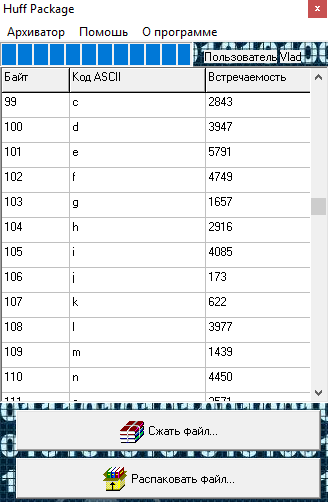

# Huffman Data Archiver

Functions performed by the software:
- selection of the archived file;
- the choice of the file for unpacking;
- save the compressed file with the extension .hfm;
- save the unpacked file with its original extension;
- view information on the compression and decompression of the file;
- the study of the Huffman algorithm.

Output data:
- compressed / unpacked file;
- user information;
- information about user actions;
- information on the process of compressing / unpacking

# Description

This algorithm provides a high degree of compression of text messages (both short and long) with some common linguistic characteristic: the same alphabet, the same popular combinations of characters, and so on.
When using programs, it is always useful to have access to information containing information about the user, actions performed by the user, the result and success of the program. Therefore, a graphical user interface is implemented, containing a registration / authorization window and providing simple and clear navigation through the program. You can get information about the program, learn the mechanism of the Huffman algorithm. The administrator has the ability to view statistics on actions taken by users, delete and edit statistics records, as well as the ability to delete a user.
